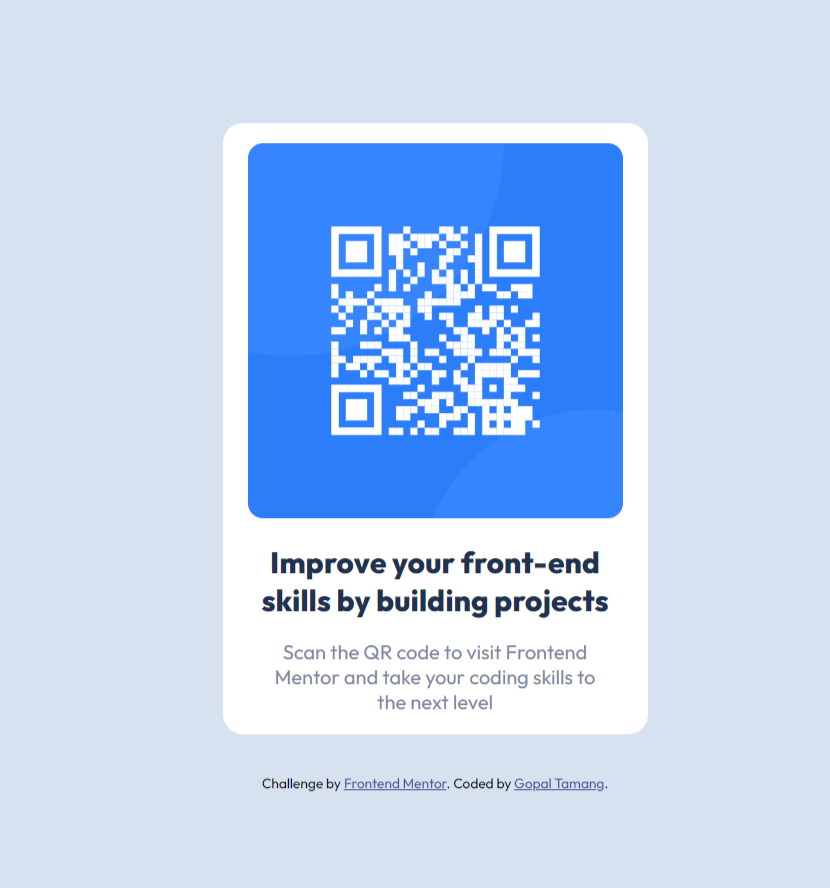

# Frontend Mentor - QR code component solution

This is a solution to the [QR code component challenge on Frontend Mentor](https://www.frontendmentor.io/challenges/qr-code-component-iux_sIO_H). Frontend Mentor challenges help you improve your coding skills by building realistic projects.

## Table of contents

- [Overview](#overview)
  - [Screenshot](#screenshot)
  - [Links](#links)
- [My process](#my-process)
  - [Built with](#built-with)
  - [What I learned](#what-i-learned)
  - [Useful resources](#useful-resources)
- [Author](#author)

## Overview

### Screenshot

The screenshot of the solution is added in the images folder.

### Links

- Solution URL: [Add solution URL here](https://your-solution-url.com)
- Live Site URL: [Add live site URL here](https://your-live-site-url.com)

## My process

### Built with

- Semantic HTML5 markup
- CSS custom properties
- Flexbox

### What I learned

I learn about flexbox and var() . I used variable using var(). I also added external css file.

### Useful resources

- [Example resource 1](https://www.w3schools.com/css/css3_flexbox_container.asp) - This helped me to use flexbox, and how to align items in center.

## Author

- Website - [Gopa Tamang] (https://github.com/GROYAL001)
- Frontend Mentor - [@GROYAL001](https://www.frontendmentor.io/profile/GROYAL001)
